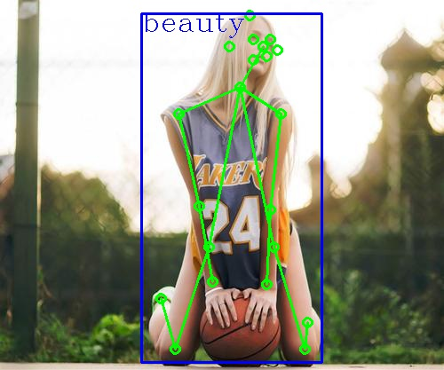

# awesome_stolen_projects
A repository related some awsome stolen projects

### **1. 去除同级目录下重复图片**       [代码](./human_key_point_detection)  [详细内容](./human_key_point_detection/README.md)

- 可以检测单张图片的关键点（测试用）
- 可以对视频进行关键点检测（TKinter界面）

喜欢的朋友请点点 star，关注我的[CSDN](https://mp.csdn.net/console/article)博客，关注我的[哔哩哔哩](https://space.bilibili.com/424394389?spm_id_from=333.788.b_765f7570696e666f.1)，关注我的公众号CV伴读社

